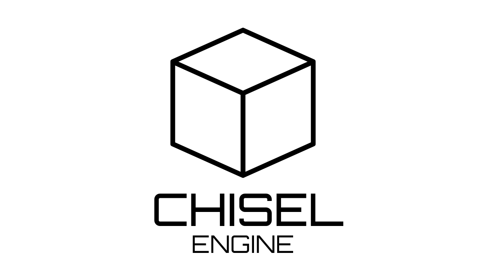

# Chisel Engine
A small voxel engine written in C++17, created entirely for messing around with graphics programming and other educational purposes.

# Features
There aren't any notable feature yet as this engine has been around for only ~4 months. But, at least it has:

- World sub-division system.
- Basic procedural terrain generation.
- Block-breaking mechanism implemented using the DDA algorithm.

# Goals
Of course, I want to add more content to this engine so it's less boring. Here's a list of stuff I want to add next:

- [ ] Texturing for each block.
- [ ] MSAA so the graphics looks less edgy.
- [ ] Frustum culling.
- [ ] SSAO.

There may be more but I will focus on what's important for now.

# Platform

| Platform              | Compiler | Build system | Graphics API |
|-----------------------|----------|--------------|--------------|
| Windows               | g++ (MinGW64)     | CMake         | OpenGL       |
| Debian-Based Distros  | g++      | CMake         | OpenGL       |

# Building

The executable will be in the generated `bin` folder along side with some resources for the engine to run properly.

If the program throw an error like `terminate called after throwing an instance of 'int'` or anything related to that even though it compiled successfully, then it might be that the program can't find certain resources like lacking shader files or images. Make sure the `resources` folder is always present in the same level as the executable.

## Windows

### Requirements
- MSYS2: For installing MinGW64 UCRT toolchain, other packages, and building Chisel.

### Packages
- `mingw-w64-ucrt-x86_64-toolchain`
- `mingw-w64-ucrt-x86_64-cmake`
- `mingw-w64-ucrt-x86_64-SDL2`
- `mingw-w64-ucrt-x86_64-glm`
- `mingw-w64-ucrt-x86_64-glew`

Install the packages via the MSYS2 UCRT Bash Terminal:

```
$ pacman -S mingw-w64-ucrt-x86_64-toolchain mingw-w64-ucrt-x86_64-cmake mingw-w64-ucrt-x86_64-SDL2 mingw-w64-ucrt-x86_64-glm mingw-w64-ucrt-x86_64-glew
```

### Building
Build Chisel via the MSYS2 UCRT Bash Terminal:
```
$ mkdir build
$ cd build
$ cmake .. -G "MinGW Makefiles"
$ cmake --build . --parallel
```

## Debian-Based Distros

For now, I only provide support for any Debian-based distros that have `apt` since there're pre-built binaries of `SDL2`, `glm`, and `glew` on there.

### Packages

- `libsdl2-dev`
- `libglm-dev`
- `libglew-dev`

```
$ sudo apt update
$ sudo apt install libsdl2-dev libglm-dev libglew-dev
```

### Building

```
$ mkdir build
$ cd build
$ cmake .. -G "Unix Makefiles"
$ cmake --build . --parallel
```


# License

This software is licensed under the [Apache License, Version 2.0](/licenses/LICENSE).


```
Copyright 2024 Nguyen Vinh Phu

Licensed under the Apache License, Version 2.0 (the "License");
you may not use this file except in compliance with the License.
You may obtain a copy of the License at

    http://www.apache.org/licenses/LICENSE-2.0

Unless required by applicable law or agreed to in writing, software
distributed under the License is distributed on an "AS IS" BASIS,
WITHOUT WARRANTIES OR CONDITIONS OF ANY KIND, either express or implied.
See the License for the specific language governing permissions and
limitations under the License.
```

# External Libraries Attributions

- [stb](https://github.com/nothings/stb): Single-file public domain (or MIT licensed) libraries for C/C++.

- [Dear Imgui](https://github.com/ocornut/imgui): Bloat-free graphical user interface library for C++

- [glew](https://glew.sourceforge.net/): The OpenGL Extension Wrangler Library.

- [glm](https://glm.g-truc.net/0.9.9/index.html): OpenGL Mathematics.

- [SDL2](https://www.libsdl.org/): Simple DirectMedia Layer.